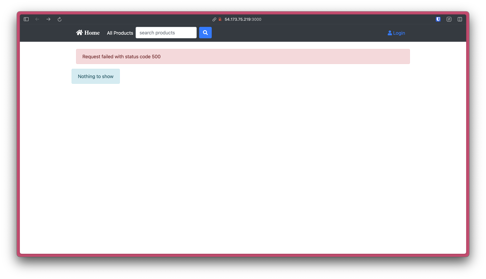
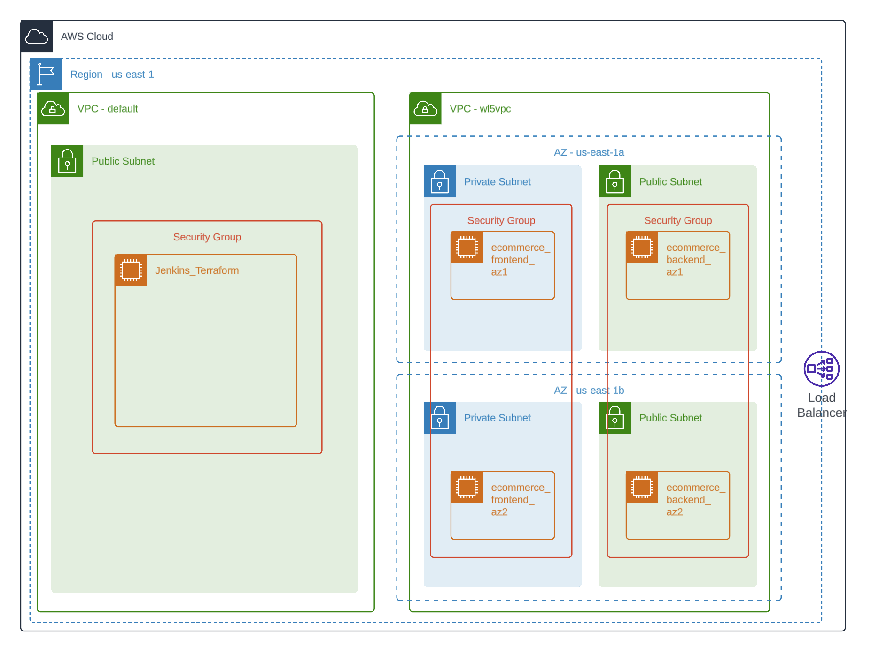

## Purpose

This workload focuses on deploying an e-commerce application to AWS Cloud Infrastructure that is secure, available, and fault tolerant. The deployment leverages Infrastructure as Code and a CI/CD pipeline to be able to spin up or modify infrastructure as needed. As a growing company, my client is also looking to leverage data and technology for Business Intelligence to make decisions on what to focus on.

## Steps

Before automating the deployment, I want to familiarize myself with the application by deploying the application manually and "locally" at a small scale in the cloud:

1. Create 2 EC2's: one for the React frontend (port 3000) and another for the Django backend (port 8000). The application uses sqlite for the database.
2. Clone this repo in each instance, install necessary dependencies (python for backend, node for frontend), and configure settings (IP addresses in `settings.py` for backend and `package.json` for frontend)
3. Start servers and launch frontend (public_ip, port 3000) to analyze website.

Functional website:


Website with no backend connected:



After familiarizing myself with the e-commerce app I am deploying, I move forward with automation:

1. Create a t3.medium instance for Jenkins and Terraform, called "Jenkins_Terraform"
  1. Ports: 22 (SSH), 8080 (Jenkins)
  2. Run `scripts/setup_jenkins.sh` and `scripts/setup_tf.sh` to install Jenkins and Terraform
2. Create Terraform scripts to build out infrastructure, including VPC, EC2s, Subnets, Load Balancer, and RDS instance.
  1. EC2 instances should run `frontend_setup.sh` and `backend_setup.sh` as appropriate to initialize frontend and backend servers, along with connection to the RDS instance.
3.

### Jenkins Build Status


## System Design Diagram

## Issues/Troubleshooting

Initial system design, made before building out full infrastructure:



## Optimization

## Business Intelligence

2. In order to count the rows of data in each table, you can run the following query:

```sql
SELECT COUNT(*) FROM <table_name>;
```

3.

## Conclusion

Creating IAM role for Terraform AWS access:

- Create IAM role
- Select "AWS service"
- Select "EC2" as use case
- Select policies
 	- AmazonEC2FullAccess
 	- AmazonRDSFullAccess
- Assign to Jenkins_Terraform EC2 via console
 	- Actions -> Security -> Modify IAM Role
